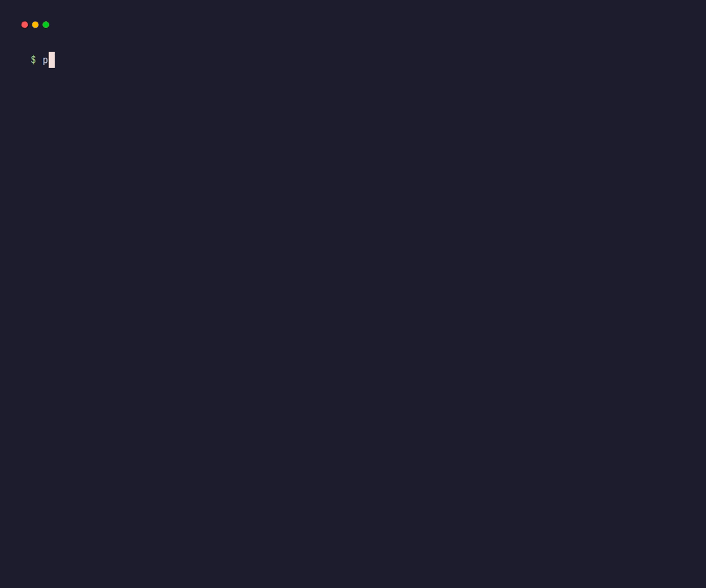

# proof

**Don't trust your coding agent. Test its work.**

[](https://nodejs.org)
[](LICENSE)
[-lightgrey)](package.json)

Coding agents write code and then judge their own work: the unit tests pass, so they report
success — while the button is wired to nothing. `proof` is an independent verification layer
between an agent's implementation and its claim of completion: a readable acceptance
contract in your repo, executed against the *running application*, producing a verdict
backed by evidence.



> Passing the existing test suite is not the same as satisfying the requirement.

## Install

```bash
npm install -g proof-cli
```

Browser checks additionally need Playwright (optional — only if your contract uses the
`browser:` verb):

```bash
npm i -D playwright && npx playwright install chromium
```

## Quick start

**1. Create a contract.** `init` seeds it from your repo's own build/test commands and dev
script:

```bash
proof init "users can log in and see their profile"
```

**2. Describe "done" in `.proof/spec.yaml`.** Checks run against the app proof starts for
you:

```yaml
goal: users can log in and see their profile
serve:
  run: npm run dev
  ready_url: http://localhost:3000
checks:
  - name: build
    run: npm run build
  - name: login sets a session
    http:
      method: POST
      path: /login
      expect: {status: 200, json: {ok: true}}
  - name: profile shows the user
    http:
      path: /profile
      expect: {status: 200, body_contains: "ada"}
```

**3. Verify.** Exit 0 passed, 1 failed, 2 the contract itself is wrong:

```
$ proof check
CHECKS
  app boots               PASS
  build                   PASS
  login sets a session    PASS
  profile shows the user  FAIL

FAILURE
  Check:
    profile shows the user
  Expected:
    status 200, body contains "ada"
  Observed:
    status 500

VERDICT
  NOT DONE
```

**4. Read the evidence.** Every run records what it saw under `.proof/runs/`:

```bash
proof report          # render the latest run as markdown, with the evidence linked
proof report --list   # every recorded run and its verdict
```

That's the loop: implement → `proof check` → read evidence → fix → `proof check` → DONE.

## Commands

| Command | What it does |
| --- | --- |
| `proof init "<requirement>"` | Write an acceptance contract seeded from the repo's own commands |
| `proof check` | Execute the contract against the running app; record evidence |
| `proof report [run]` | Render a run's evidence; `--list` shows all runs, `--prune` cleans old ones |
| `proof infer` | Find verification gaps in the current diff; `--write` appends them as checks |
| `proof changed` | Blast radius of the diff — what changed, what depends on it, what covers it |
| `proof guard -- <agent...>` | Supervise a coding agent: rerun it with the failure evidence until the contract passes |

Every command takes `--json`. Full flags, exit codes and JSON shapes: [docs/commands.md](docs/commands.md).

## Not just web apps

`run:`, `file:` and `env:` verify anything that runs in a shell — CLIs, pipelines, services
in any language. `infer` reads JavaScript/TypeScript, Python and Go; `changed` builds its
import graph from JavaScript/TypeScript and Python.

```yaml
goal: the export command produces a complete CSV
checks:
  - name: builds
    run: cargo build --release
  - name: export succeeds and says so
    run: ./target/release/tool export --out data.csv
    expect_output: "exported"
  - name: output has the header and no debug noise
    file: {path: data.csv, contains: "id,name,total", not_contains: "DEBUG"}
```

More worked examples — a Go API, a data pipeline, database migrations, a security fix, a
browser flow with sessions: [docs/examples.md](docs/examples.md).

## For coding agents

Agents integrate through the CLI — no plugin needed:

```bash
proof check --json    # {status, checks, failures: [{check, expected, observed, ...}]}
```

Or flip the loop around and make proof the completion gate:

```bash
proof guard --max-attempts 5 -- claude -p "implement the requirement in .proof/spec.yaml"
```

The agent stops when the contract passes — not when it feels done. Details:
[docs/agents.md](docs/agents.md).

## Documentation

| Doc | Covers |
| --- | --- |
| [docs/contract.md](docs/contract.md) | Every verb (`run`, `http`, `file`, `env`, `browser`), the `serve` block, sessions, strict validation |
| [docs/commands.md](docs/commands.md) | Each command in depth, flags, exit codes, error codes, every `--json` field |
| [docs/evidence.md](docs/evidence.md) | What a green run does and does not mean, evidence bundles, reports, regression markers |
| [docs/discovery.md](docs/discovery.md) | `changed` (blast radius) and `infer` (gap detection) in depth |
| [docs/agents.md](docs/agents.md) | The agent loop and `proof guard` |
| [docs/examples.md](docs/examples.md) | Worked contracts beyond web UI |
| [docs/design.md](docs/design.md) | Design principles, non-goals, development |

## Non-goals

Not a coding agent, not an IDE, not a test-framework replacement. Proof runs your project's
own commands and asserts on what the running application actually does.

## License

MIT.
